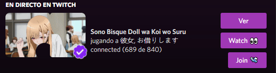

<div align="center" id="top"> 
  

  &#xa0;
</div>

<h1 align="center">Streaming-Twitch-Status-Discord</h1>

<p align="center">
  

  

  
</p>

<br>

## 🎯 About ##

This project will allow you to have a twitch streaming status on your account, it should be noted that this is prohibited and you may risk permanently deactivating your account.

If you use it, it is by your decision and I am not responsible for what may happen.

Credit: https://github.com/aiko-chan-ai

## ✨ Features ##

✔️ Twitch streaming status Discord\
✔️ Animated images\
✔️ Buttons

## 🚀 Technologies ##

The following tools were used in this project:

- [Node.js](https://nodejs.org/en/)

## ✅ Requirements ##

Before starting 🏁, you need to have [Git](https://git-scm.com) and [Node](https://nodejs.org/en/) installed.

## 🏁 Starting ##

```bash
# Clone this project
$ git clone https://github.com/Camilo404/Streaming-Twitch-Status-Discord

# Access
$ cd Streaming-Twitch-Status-Discord

# Install dependencies
$ npm install

# Remove from the .env.config file the .config
$ .env

# Edit the .env
$ PORT="8080"
$ TOKEN="mytoken"

# Run the project
$ npm run start

# The server will initialize in the <http://localhost:8080>
```

&#xa0;

<a href="#top">Back to top</a>
